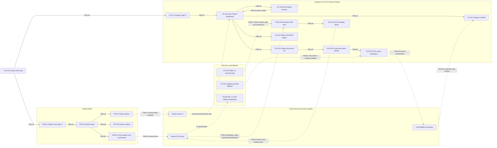

# ChroniCare User-Flow Map

Status: Proposed
Repository: ChronicCare
Product name: ChroniCare
DRI: Daniel
Product/QA reviewer: Ozan
Technical reviewer: Bernard
AI/OCR reviewer: Al
Validated against repository state: 2026-07-17
Input screen inventory: `docs/design/00-screen-inventory.md`
Input inventory SHA-256: `6D37A8DACABAE9662C7BE32A3B5FCA09C563637E3E3C03474238B52A0A23BD1C`

## Authority

This document maps interaction flow and conceptual routing between the stable surface IDs in `docs/design/00-screen-inventory.md`. It is a design coverage artifact, not an implementation routing contract. Product, safety, role, privacy, data, API, provider, execution, demo, and QA contracts remain authoritative.

Conceptual routing in this document decides actor/session context, entry guard, transition trigger, destination surface or named exit, cancellation, failure, forbidden access, session expiry, recovery, and cross-surface handoff. Exact URLs, Next.js route groups, folder paths, middleware, redirects, and navigation components are deliberately deferred until an implementation plan can inspect the Packet 01 scaffold.

No flow in this document is evidence that a feature is implemented. Current files on disk and fresh verification evidence determine implementation availability; all Packet 01–13 statuses remain `Draft`, and QA readiness remains `Not Run` until their owners record evidence.

`NEWDESIGN.md` controls visual expression and responsive shells. This map
continues to control conceptual transitions, trust boundaries, recovery, and
cross-actor handoffs without defining visual layout.

## Sources

- `AGENTS.md` — product boundary, terminology, access rules, demo flow, UI direction, verification constraints.
- `README.md` — repository orientation and documentation-first state.
- `PRODUCT.md` — strategic product adapter, actors, jobs, scope, safety, demo, and execution context.
- `NEWDESIGN.md` — Care in Motion modes, visual trust, responsive shells, and recovery expression.
- `docs/design/00-screen-inventory.md` — authoritative surface IDs, priorities, roles, modes, state obligations, and requirement coverage for this artifact.
- `docs/team/ownership.md` — DRI and review ownership.
- `docs/product/product-context.md` — challenge, users, product promise, and boundaries.
- `docs/product/feature-scope.md` — P0, P1, lifecycle, parking-lot, and out-of-scope classification.
- `docs/product/user-journeys.md` — entry conditions, happy paths, failures, recovery, and exit states.
- `docs/product/hackathon-mvp-scope-demo.md` — connected demo scope and time constraint.
- `docs/technical/architecture.md` — trust boundaries, server-side provider access, Realtime and REST recovery.
- `docs/technical/data-model.md` — Care Circle, Patient Profile, session, review status, SOS, and lifecycle state.
- `docs/technical/api.md` — actor/session boundaries, patient-bound operations, error semantics, and atomic handling.
- `docs/technical/ai-guardrails.md` — persona, context, refusal, emergency, confirmed-only OCR, and provider fallback.
- `docs/security-privacy.md` — isolation, minimum context, private documents, logging, and non-destructive lifecycle rules.
- `docs/execution/workflow.md` — 13-packet dependency sequence, freeze, handoff, and evidence rules.
- `docs/execution/packets.md` — current packet index and status source.
- `docs/execution/packets/01-scaffold-and-tooling-baseline.md` through `docs/execution/packets/13-qa-deploy-and-demo-rehearsal.md` — packet-specific outcomes, dependencies, acceptance criteria, manual QA, and stop conditions.
- `docs/pitch/demo-script.md` — two-minute connected demonstration order and fallback narration.
- `docs/qa/demo-readiness-checklist.md` — required journey, responsive, accessibility, failure, and recovery evidence.

## Scope

In scope:

- Conceptual routing between inventory surface IDs.
- Preconditions, entry guards, happy paths, cancellation, failure, recovery, and exit states.
- Trust boundaries between Patient session, Caregiver authentication, membership authorization, and active Patient context.
- Stored-state, Realtime, REST refetch, and confirmed-context handoffs.
- Detailed P0, lifecycle, and system-recovery flows plus high-level P1 flow coverage.
- Traceability to surface inventory, canonical requirements, and Packet 01–13.

Out of scope:

- Exact URLs, route names, route groups, implementation folders, middleware, or framework redirects.
- Navigation architecture, menus, tabs, breadcrumbs, or information architecture beyond flow entry points.
- Screen specifications, state matrix, UX copy matrix, responsive artifact, wireframes, prototypes, components, source code, or implementation plan.
- Promotion of P1, parking-lot, or out-of-scope capabilities into active P0 flows.

## Flow Principles

- `FLOW-` identifies a user flow; it is not a route.
- `TRN-` identifies a conceptual transition; it is not an endpoint or client navigation instruction.
- A surface ID always comes from `docs/design/00-screen-inventory.md`.
- A named exit such as `Stored SOS event` is an interaction outcome or system handoff, not a new screen.
- `Direct UI` means an actor intentionally opens another surface.
- `Stored-state handoff` means a successful write becomes input to a later authorized read; it does not imply a cross-role redirect.
- `Realtime event` is an enhancement for an authorized open caregiver dashboard; it does not guarantee closed-tab delivery.
- `REST recovery` means refetch after reconnect or focus; it remains subject to server authorization.
- `System recovery` uses `SYS-` surfaces only when an inline state cannot safely represent the failure.
- A return destination preserves the last authorized surface when safe; sensitive data is cleared when authorization or session validity is uncertain.
- One connected, recoverable P0 flow takes precedence over feature breadth.
- Patient and Caregiver flows use separate session types even when their authorized records affect the same Patient Profile.
- Processing, loading, pending, confirmed, rejected, failed, retry, and fallback remain states of owning surfaces unless the inventory already defines a distinct surface.
- Loading a new active Patient Profile clears or masks stale profile data before the new identity is displayed.

## Priority Definitions

- `P0 Demo`: appears directly in the connected two-minute demonstration.
- `P0 Support`: required to start, authorize, continue, or recover the demonstration.
- `MVP Lifecycle`: part of the MVP but not a primary demonstration step.
- `P1 Support`: considered only after P0 is stable.
- `System`: cross-mode state or recovery surface.
- `Parking Lot`: documented capability without an active implementation flow.
- `Out of Scope`: capability that must not receive an active product flow.

## Actor and Trust Boundaries

1. Patient protected surfaces require a valid Patient session bound to exactly one active Patient Profile. Patient does not select an arbitrary Patient Profile.
2. Caregiver protected surfaces require a valid Supabase Auth session, active Care Circle membership, and server authorization for every explicit `patientProfileId`.
3. Active Patient UI state provides orientation only. It never replaces server authorization or relation checks.
4. Owner-only surfaces additionally require the server-authorized active Owner role. Family Member visibility never grants Owner-only action authority.
5. Wrong-role access returns `SYS-02`; concealed or unavailable resources may return `SYS-04` without disclosing another Care Circle or Patient Profile.
6. Expired or revoked sessions return `SYS-03`, clear protected context, and recover through the actor-appropriate sign-in surface.
7. A deactivated Patient Profile is removed from active selection. Its Patient access codes and Patient sessions are revoked non-destructively.
8. Provider fallback is explicitly represented by `SYS-06` or a labeled state on the owning surface. Fallback never impersonates a live provider result.
9. Offline or Realtime interruption uses `SYS-05` plus REST recovery where applicable. The last known data is not presented as newly confirmed truth.
10. All cross-role effects are stored-state or authorized subscription handoffs, never an automatic actor switch.

Patient session and caregiver authentication are separate trust domains. A Patient session is bound server-side to one active Patient Profile. A caregiver Supabase Auth session establishes identity but still requires active Care Circle membership, role checks, and the Patient Profile relation for each operation. Every caregiver patient-bound transition carries explicit `patientProfileId`; the server, not the active UI selection, authorizes it.

A stored-state handoff means one actor's accepted write becomes available to a later authorized read. It does not create shared browser session state. Data cannot cross Care Circles or Patient Profiles. A deactivated Patient Profile is removed from active flows; Patient access codes and Patient sessions are revoked while retained history and audit remain non-destructive.

## Main Demo Flow

The diagram describes a connected demonstration, not a promise that every step is a direct navigation. Patient and Caregiver remain separate actors and sessions. Check-in, confirmed OCR, and SOS cross modes only through authorized stored state or Realtime events. REST recovery is distinct from Realtime delivery.

| Demo segment | Target relationship | Primary transition IDs | Fallback or demo cut |
|---|---|---|---|
| Patient entry and check-in/chat | Establish Patient session and complete one concise Patient task | TRN-03, TRN-13–14 or TRN-33–35 | Use one of check-in or chatbot if time compresses; never cut session/profile truth |
| Caregiver entry and Maya/Raka switch | Establish caregiver session and prove isolation | TRN-07, TRN-18–20 | Pre-stage authentication if necessary; retain visible Patient identity and fresh reload |
| Upload, OCR review, and confirmation | Move from private document to human-confirmed structured context | TRN-24–32 | Use labeled `DEMO_FALLBACK` if provider is unavailable; never bypass review |
| Caregiver chatbot | Use only authorized daily-care and confirmed extraction context | TRN-37–39 | Use labeled safe fallback or omit unavailable context |
| SOS create, alert, and handle | Store Patient event, notify open dashboard, atomically handle | TRN-40–47 | If Realtime/audio fails, use visual state plus REST refetch; never claim closed-tab delivery |
| Faskes/BPJS | Show a sourced administrative next step | TRN-48–50 | Show static/labeled fallback or cut result detail; keep direct-confirmation limitation |

The full connected rehearsal target remains at most two minutes. Demo cuts remove optional narration or a secondary branch, not authorization, human review, limitation copy, or truthful fallback.

## Flow Catalog

| Flow ID | Flow | Priority | Actors | Session | Start | End | Screen IDs | Transition IDs | Packet | Detailed |
|---|---|---|---|---|---|---|---|---|---|---|
| FLOW-01 | Product role entry | P0 Support | Patient, Caregiver | None | SYS-01 | PAT-01 or CG-01 | SYS-01, PAT-01, CG-01 | TRN-01, TRN-02 | 01, 04, 05 | Yes |
| FLOW-02 | Patient sign-in and recovery | P0 Support | Patient | Patient session | PAT-01 or SYS-03 | PAT-02 | PAT-01, PAT-02, SYS-02, SYS-03, SYS-07 | TRN-03–06, TRN-11 | 05 | Yes |
| FLOW-03 | Caregiver sign-in and membership | P0 Support | Caregiver | Supabase Auth | CG-01 or SYS-03 | CG-02 | CG-01, CG-02, SYS-02, SYS-03, SYS-04, SYS-07 | TRN-07–12 | 04 | Yes |
| FLOW-04 | Patient daily check-in | P0 Demo | Patient | Patient session | PAT-02 | PAT-02 with stored check-in | PAT-02, PAT-03, SYS-02, SYS-03, SYS-05, SYS-07 | TRN-13–15, TRN-54–55 | 07 | Yes |
| FLOW-05 | Reminder and medication reading | P0 Support | Patient | Patient session | PAT-02 | PAT-02 | PAT-02, PAT-04, SYS-02–05, SYS-07 | TRN-16–17, TRN-54–55 | 07 | Yes |
| FLOW-06 | Active Patient switch and isolation | P0 Demo | Caregiver | Supabase Auth | CG-02 | CG-02 fresh Patient context | CG-02, CG-03, SYS-02–05, SYS-07 | TRN-18–20, TRN-54–55 | 05, 08 | Yes |
| FLOW-07 | Caregiver daily-care update | P0 Support | Owner, Family Member | Supabase Auth | CG-02 | CG-04 saved or CG-02 | CG-02, CG-04, SYS-02–05, SYS-07 | TRN-21–23, TRN-54–55 | 08 | Yes |
| FLOW-08 | Private document upload | P0 Demo | Owner, Family Member | Supabase Auth | CG-02 or OCR-01 | OCR-03 pending/fallback | CG-02, OCR-01–03, SYS-02–07 | TRN-24–28, TRN-54–55 | 02, 09 | Yes |
| FLOW-09 | OCR review and decision | P0 Demo | Owner, Family Member | Supabase Auth | OCR-03 | Confirmed, rejected, or pending exit | OCR-01, OCR-03, CG-05, SYS-02–07 | TRN-28–32, TRN-54–55 | 09, 11 | Yes |
| FLOW-10 | Patient chatbot | P0 Demo | Patient | Patient session | PAT-02 | PAT-05, SOS-01, or fallback | PAT-02, PAT-05, SOS-01, SYS-02–07 | TRN-33–36, TRN-54–55 | 02, 11 | Yes |
| FLOW-11 | Caregiver chatbot | P0 Demo | Owner, Family Member | Supabase Auth | CG-02 | CG-05, CG-03, or fallback | CG-02, CG-03, CG-05, OCR-03, SYS-02–07 | TRN-32, TRN-37–39, TRN-54–55 | 02, 05, 11 | Yes |
| FLOW-12 | Patient SOS creation | P0 Demo | Patient | Patient session | PAT-02 or PAT-05 | Stored SOS event | PAT-02, PAT-05, SOS-01, SYS-02–05, SYS-07 | TRN-40–42, TRN-54–55 | 12 | Yes |
| FLOW-13 | Cross-actor SOS handling | P0 Demo | Patient, Owner, Family Member | Separate Patient and caregiver sessions | Stored SOS event or SOS-02 | SOS-03 handled/conflict | SOS-01–03, SYS-02–05, SYS-07 | TRN-42–47, TRN-54–55 | 12 | Yes |
| FLOW-14 | Faskes/BPJS guidance | P0 Demo | Owner, Family Member | Supabase Auth | CG-02 | CG-06 result/empty/fallback | CG-02, CG-06, SYS-03, SYS-05–07 | TRN-48–50, TRN-54–55 | 02, 10 | Yes |
| FLOW-15 | Owner deactivation | MVP Lifecycle | Owner; Family Member/Patient denied | Supabase Auth | CG-02 | Deactivated-profile exit or CG-02 | CG-02, OWN-04, SYS-02–05, SYS-07 | TRN-51–55 | 06 | Yes |
| FLOW-16 | System recovery integration | System | Current actor | Actor-appropriate | Owning surface | Recovered surface or sign-in | SYS-02–07 plus owning surfaces | TRN-05–12, TRN-47, TRN-54–55 | 02, 04–13 | Yes |
| FLOW-17 | Care Circle member management | P1 Support | Owner | Supabase Auth | Caregiver context | OWN-01 | OWN-01, SYS-02, SYS-03 | TRN-56 | 04 | No |
| FLOW-18 | Patient access code management | P1 Support | Owner | Supabase Auth | Caregiver context | OWN-02 | OWN-02, SYS-02–04 | TRN-57 | 05 | No |
| FLOW-19 | Add second Patient Profile | P1 Support | Owner | Supabase Auth | Caregiver context | OWN-03 | OWN-03, SYS-02, SYS-07 | TRN-58 | 03, 05, 06 | No |
| FLOW-20 | Care activity history | P1 Support | Owner, Family Member | Supabase Auth | CG-02 | CG-07 | CG-02, CG-07, SYS-02–04 | TRN-59 | 08 | No |
| FLOW-21 | SOS history | P1 Support | Owner, Family Member | Supabase Auth | CG-02 or SOS context | SOS-04 | CG-02, SOS-02–04, SYS-02–04 | TRN-60 | 12 | No |

## Conceptual Routing Contract

| Transition ID | Actor | Session | From | Trigger | Guard or Entry Condition | To or Exit State | Failure/Forbidden Destination | Recovery | Transition Type |
|---|---|---|---|---|---|---|---|---|---|
| TRN-01 | Patient | None | SYS-01 | Choose Patient access | Public entry available | PAT-01 | SYS-07 | Retry SYS-01 | UI transition |
| TRN-02 | Caregiver | None | SYS-01 | Choose Caregiver access | Public entry available | CG-01 | SYS-07 | Retry SYS-01 | UI transition |
| TRN-03 | Patient | Patient session creation | PAT-01 | Submit valid access code | Active profile and code validated server-side | PAT-02 | PAT-01 or SYS-07 | Correct code or retry | Session transition |
| TRN-04 | Patient | None | PAT-01 | Submit invalid/revoked code | Identity remains concealed | PAT-01 validation state | PAT-01 | Retry valid code | Server-authorized transition |
| TRN-05 | Patient | Expired/revoked Patient session | Patient protected surface | Protected request fails | Session invalid | SYS-03 | SYS-03 | TRN-06 | Session transition |
| TRN-06 | Patient | None | SYS-03 | Re-enter Patient access | Patient actor context | PAT-01 | SYS-07 | Retry SYS-03 | UI transition |
| TRN-07 | Caregiver | Caregiver auth session | CG-01 | Submit valid credentials | Auth and active membership validated | CG-02 | CG-01 or SYS-02 | Retry or use authorized account | Session transition |
| TRN-08 | Caregiver | None | CG-01 | Submit invalid credentials | No membership/profile disclosure | CG-01 validation state | CG-01 | Correct and retry | Server-authorized transition |
| TRN-09 | Caregiver | Expired/revoked auth session | Caregiver protected surface | Protected request fails | Session or membership invalid | SYS-03 | SYS-03 | TRN-10 | Session transition |
| TRN-10 | Caregiver | None | SYS-03 | Re-enter caregiver access | Caregiver actor context | CG-01 | SYS-07 | Retry SYS-03 | UI transition |
| TRN-11 | Any protected actor | Actor-appropriate | Protected surface | Wrong role/profile/Care Circle | Server denies authorization | SYS-02 | SYS-02 | Last authorized surface or sign-in | Server-authorized transition |
| TRN-12 | Any protected actor | Actor-appropriate | Protected resource | Missing/concealed/deactivated resource | Existence cannot be disclosed | SYS-04 | SYS-04 | Last authorized context | Server-authorized transition |
| TRN-13 | Patient | Valid Patient session | PAT-02 | Start check-in | Bound active profile | PAT-03 | SYS-03 or SYS-07 | Reauthenticate or retry | UI transition |
| TRN-14 | Patient | Valid Patient session | PAT-03 | Submit check-in | Write bound server-side to session profile | PAT-02 success state | PAT-03 or SYS-07 | Correct or idempotent retry | Server-authorized transition |
| TRN-15 | Patient | Valid Patient session | PAT-03 | Cancel | No accepted write | PAT-02 | Not applicable | PAT-02 | Exit |
| TRN-16 | Patient | Valid Patient session | PAT-02 | Open reminder/medication detail | Bound profile read | PAT-04 | SYS-03, SYS-04, or empty state | Reauthenticate or PAT-02 | UI transition |
| TRN-17 | Patient | Valid Patient session | PAT-04 | Back | Session still valid | PAT-02 | SYS-03 | Reauthenticate | Exit |
| TRN-18 | Caregiver | Valid auth session | CG-02 | Open Patient selector | Active membership | CG-03 | SYS-02 or SYS-03 | CG-02 or reauthenticate | UI transition |
| TRN-19 | Caregiver | Valid auth session | CG-03 | Select Patient Profile | Membership and patientProfileId relation validated | CG-02 with fresh context | SYS-02, SYS-04, or SYS-07 | Keep last authorized profile and retry | Server-authorized transition |
| TRN-20 | Caregiver | Valid auth session | CG-03 | Cancel | Last profile remains authorized | CG-02 unchanged | Not applicable | CG-02 | Exit |
| TRN-21 | Caregiver | Valid auth session | CG-02 | Open daily care | Explicit authorized patientProfileId | CG-04 | SYS-02, SYS-03, or SYS-04 | CG-02 or reauthenticate | UI transition |
| TRN-22 | Caregiver | Valid auth session | CG-04 | Save change | Membership/profile relation revalidated | CG-04 saved or CG-02 refreshed | Conflict, SYS-02, or SYS-07 | Refresh, reconcile, retry | Server-authorized transition |
| TRN-23 | Caregiver | Valid auth session | CG-04 | Cancel | No accepted write | CG-02 | Not applicable | CG-02 | Exit |
| TRN-24 | Caregiver | Valid auth session | CG-02 | Open documents | Explicit authorized patientProfileId | OCR-01 | SYS-02, SYS-03, or SYS-04 | CG-02 or reauthenticate | UI transition |
| TRN-25 | Caregiver | Valid auth session | OCR-01 | Start upload | Active Patient authorization | OCR-02 | SYS-02 or SYS-03 | OCR-01 or reauthenticate | UI transition |
| TRN-26 | Caregiver | Valid auth session | OCR-02 | Submit valid file | Type/size/page validation and private boundary pass | OCR-03 processing/pending state | OCR-02, SYS-06, or SYS-07 | Correct, retry, or labeled fallback | Server-authorized transition |
| TRN-27 | Caregiver | Valid auth session | OCR-02 | Cancel | No accepted upload | OCR-01 | Not applicable | OCR-01 | Exit |
| TRN-28 | Caregiver | Valid auth session | OCR-03 | Draft becomes reviewable | Authorized Zod-valid draft with provenance | OCR-03 review state | OCR-03 error or SYS-06 | Retry or `DEMO_FALLBACK` | Fallback transition |
| TRN-29 | Caregiver | Valid auth session | OCR-03 | Confirm reviewed fields | Explicit human decision and reauthorization | OCR-03 `CONFIRMED` | Conflict, SYS-02, or SYS-07 | Refresh and reconfirm | Server-authorized transition |
| TRN-30 | Caregiver | Valid auth session | OCR-03 | Reject draft | Explicit human decision and reauthorization | OCR-03 `REJECTED` | Conflict, SYS-02, or SYS-07 | Refresh and retry decision | Server-authorized transition |
| TRN-31 | Caregiver | Valid auth session | OCR-03 | Leave without decision | Status remains `PENDING_REVIEW` | OCR-01 | SYS-03 | Reopen pending document | Exit |
| TRN-32 | Caregiver | Valid auth session | OCR-03 `CONFIRMED` | Chatbot later requests context | Same profile; minimum confirmed data only | Confirmed-context named exit for CG-05 | Context omitted | Continue without untrusted context | Stored-state handoff |
| TRN-33 | Patient | Valid Patient session | PAT-02 | Open Patient chatbot | Bound active profile | PAT-05 | SYS-03 or SYS-07 | Reauthenticate or retry | UI transition |
| TRN-34 | Patient | Valid Patient session | PAT-05 | Allowed request | Minimum authorized context | PAT-05 safe response | SYS-06 | Labeled fallback or retry | Server-authorized transition |
| TRN-35 | Patient | Valid Patient session | PAT-05 | Forbidden clinical request | Safety gateway refuses | PAT-05 refusal state | Not applicable | Offer allowed support | Exit |
| TRN-36 | Patient | Valid Patient session | PAT-05 | Possible emergency | Short escalation required | SOS-01 | SYS-07 | Retry SOS entry and show limitation | UI transition |
| TRN-37 | Caregiver | Valid auth session | CG-02 | Open Caregiver chatbot | Explicit authorized patientProfileId | CG-05 | SYS-02, SYS-03, or SYS-04 | Restore context or reauthenticate | UI transition |
| TRN-38 | Caregiver | Valid auth session | CG-05 | Allowed request | Minimum daily care and confirmed OCR only | CG-05 safe response | SYS-06 or context omitted | Labeled fallback or reduced context | Server-authorized transition |
| TRN-39 | Caregiver | Valid auth session | CG-05 | Change Patient | Cross-profile chat context prohibited | CG-03 | SYS-02 or SYS-03 | Select authorized profile and reopen | UI transition |
| TRN-40 | Patient | Valid Patient session | PAT-02 or PAT-05 | Start SOS | Bound active profile | SOS-01 | SYS-03 or SYS-07 | Reauthenticate or retry | UI transition |
| TRN-41 | Patient | Valid Patient session | SOS-01 | Cancel | No event created | Originating Patient surface | Not applicable | Originating Patient surface | Exit |
| TRN-42 | Patient | Valid Patient session | SOS-01 | Confirm SOS | Store minimum bound event | Stored SOS event plus acknowledgement | SYS-07 | Explicit retry; no delivery claim | Stored-state handoff |
| TRN-43 | Caregiver | Valid auth session | Stored SOS event | Realtime event arrives | Authorized matching open dashboard | SOS-02 | SYS-05 or no closed-tab delivery | TRN-47 | Realtime notification |
| TRN-44 | Caregiver | Valid auth session | SOS-02 | Open alert | SOS profile relation authorized | SOS-03 | SYS-02, SYS-03, or SYS-04 | Alert context or reauthenticate | UI transition |
| TRN-45 | Caregiver | Valid auth session | SOS-03 | Select `Saya tangani` | Atomic first-handler-wins | SOS-03 handled state | SOS-03 conflict or SYS-07 | Refresh current handler | Server-authorized transition |
| TRN-46 | Caregiver | Valid auth session | SOS-03 | Another handler wins | Latest server state supersedes UI | SOS-03 current-handler state | Not applicable | Acknowledge current truth | Server-authorized transition |
| TRN-47 | Caregiver | Valid auth session | SYS-05 or caregiver surface | Reconnect/focus | Membership revalidated | Latest authorized SOS state | SYS-03, SYS-05, or SYS-07 | Reauthenticate or retry | REST recovery |
| TRN-48 | Caregiver | Valid auth session | CG-02 | Open helper | Valid membership | CG-06 | SYS-03 or SYS-07 | Reauthenticate or retry | UI transition |
| TRN-49 | Caregiver | Valid auth session | CG-06 | Apply filters | Static sourced Tangerang data available | CG-06 results/empty | SYS-06 or SYS-07 | Clear, retry, or labeled fallback | Server-authorized transition |
| TRN-50 | Caregiver | Valid auth session | CG-06 | Back | Session valid | CG-02 | SYS-03 | Reauthenticate | Exit |
| TRN-51 | Owner | Valid auth session | CG-02 | Open deactivation | Active Owner and profile relation | OWN-04 | SYS-02, SYS-03, or SYS-04 | CG-02 or reauthenticate | Server-authorized transition |
| TRN-52 | Owner | Valid auth session | OWN-04 | Cancel | Profile remains active | CG-02 | Not applicable | CG-02 | Exit |
| TRN-53 | Owner | Valid auth session | OWN-04 | Confirm deactivation | Sensitive confirmation and Owner check pass | Deactivated-profile named exit; valid caregiver context | Conflict, SYS-02, SYS-03, or SYS-07 | Refresh lifecycle truth | Server-authorized transition |
| TRN-54 | Current actor | Actor-appropriate | Owning surface | Recoverable request failure | Session/authorization still valid | SYS-07 or owning inline error | SYS-03 if invalid | Retry/refetch/reauthenticate | Fallback transition |
| TRN-55 | Current actor | Actor-appropriate | SYS-07 | Retry | Original guard revalidated | Owning surface | SYS-07, SYS-02, or SYS-03 | Stop unsafe loop; preserve failure | REST recovery |
| TRN-56 | Owner | Valid auth session | Authorized caregiver context | Open member management | Active Owner | OWN-01 | SYS-02 or SYS-03 | Caregiver context | UI transition |
| TRN-57 | Owner | Valid auth session | Authorized caregiver context | Open code management | Active Owner and profile relation | OWN-02 | SYS-02, SYS-03, or SYS-04 | Caregiver context | UI transition |
| TRN-58 | Owner | Valid auth session | Authorized caregiver context | Add second profile | Active Owner and fewer than two profiles | OWN-03 | SYS-02 or capacity conflict | No third profile created | UI transition |
| TRN-59 | Caregiver | Valid auth session | CG-02 | Open activity history | Authorized patientProfileId | CG-07 | SYS-02, SYS-03, or SYS-04 | CG-02 | UI transition |
| TRN-60 | Caregiver | Valid auth session | CG-02 or SOS context | Open SOS history | Authorized profile relation | SOS-04 | SYS-02, SYS-03, or SYS-04 | CG-02 or SOS context | UI transition |

## Detailed P0 and Lifecycle Flows

### FLOW-01 — Product Entry and Actor Path

#### Purpose

Direct a public visitor into the correct, separate Patient or Caregiver access path without protected-data exposure.

#### Priority

P0 Support.

#### Actors and Sessions

Patient or Caregiver before authentication; no session.

#### Trigger

Actor chooses an access role from SYS-01.

#### Entry Conditions

SYS-01 is available; no protected identity or profile context is loaded.

#### Preconditions

- Public product entry can load without exposing protected content.

#### Authorization and Trust Boundary

- No authentication is required to choose an actor path. Existing valid sessions may later be recognized by actor-specific entry logic, but one actor session must never silently become the other actor.

#### Surfaces

SYS-01, PAT-01, CG-01.

#### Happy Path

1. Visitor identifies whether they are entering as Patient or Caregiver.
2. Patient choice follows TRN-01 to PAT-01.
3. Caregiver choice follows TRN-02 to CG-01.

#### Alternate Path

- A visitor who chose the wrong actor returns to public entry and selects the other path; no protected state is carried across.

#### Failure and Recovery

- Entry load failure uses SYS-07 and a retry that returns to the same public decision.

#### Forbidden and Negative Paths

- Direct protected access without an actor-valid session follows the relevant session-expired flow, not public data disclosure.

#### Session-Expired Behavior

- Not applicable before authentication; protected direct entries use FLOW-02 or FLOW-03.

#### Offline/Reconnect Path

- Offline public entry may show SYS-05; it cannot imply a session or cached health data is current.

#### Fallback

- Not applicable; actor selection has no external AI/OCR provider dependency.

#### Conflict Path

- Not applicable; no shared record is mutated.

#### Direct-Entry Behavior

SYS-01 may be entered directly because it is public. Direct entry to PAT-01 or CG-01 is allowed without protected data; any protected destination still applies its actor-specific session guard.

#### Cancel or Back Behavior

- Leaving public entry has no protected-state consequence.

#### Conceptual Routing

- TRN-01 and TRN-02.

#### Stored-State and Cross-Actor Effects

- None.

#### Exit State

- PAT-01 or CG-01 is visible with no cross-actor protected context.

#### Demo Relevance

P0 support for separate entry paths; the two-minute demo may begin at PAT-01 when SYS-01 is pre-established.

#### Packet Coverage

Packets 01, 04, and 05.

#### Canonical Evidence

`AGENTS.md` §§5, 8; `docs/product/user-journeys.md`; Packets 04–05.

### FLOW-02 — Patient Sign-In and Session Recovery

#### Purpose

Create or restore a Patient session bound to exactly one active Patient Profile.

#### Priority

P0 Support.

#### Actors and Sessions

Patient; Patient session created only after server validation.

#### Trigger

Patient submits a Patient access code or returns from SYS-03.

#### Entry Conditions

PAT-01 or SYS-03 is visible and no unvalidated Patient identity is exposed.

#### Preconditions

- An active Patient Profile has a valid Patient access code; demo data is synthetic.

#### Authorization and Trust Boundary

- PAT-01 never reveals Patient identity before server validation. Protected Patient surfaces require a bound Patient session.

#### Surfaces

PAT-01, PAT-02, SYS-02, SYS-03, SYS-07.

#### Happy Path

1. Patient submits the Patient access code.
2. Server validates the code and active Patient Profile.
3. Server creates a Patient session bound to that single profile.
4. TRN-03 opens PAT-02.

#### Alternate Path

- Invalid, expired, revoked, or deactivated-profile codes remain on PAT-01 through TRN-04 with generic feedback.

#### Failure and Recovery

- Transient failure remains recoverable on PAT-01 or SYS-07; retry must not create duplicate sessions or disclose profile data.

#### Forbidden and Negative Paths

- A Patient attempting caregiver or another Patient Profile data follows TRN-11.

#### Session-Expired Behavior

- TRN-05 clears protected Patient context; TRN-06 returns to PAT-01.

#### Offline/Reconnect Path

- Login cannot be treated as successful offline. SYS-05 returns to PAT-01 after connection recovery.

#### Fallback

- Not applicable; Patient authentication is not an AI/OCR fallback surface.

#### Conflict Path

- A code revoked during submission is treated as invalid; no stale session is accepted.

#### Direct-Entry Behavior

Direct PAT-02 entry succeeds only with a valid bound Patient session. Missing or expired session uses SYS-03 then PAT-01; wrong or deactivated profile uses SYS-02 or concealed SYS-04.

#### Cancel or Back Behavior

- Patient may return to product entry before submission. Leaving after session creation requires protected context to remain actor-bound.

#### Conceptual Routing

- TRN-03 through TRN-06 and TRN-11.

#### Stored-State and Cross-Actor Effects

- A validated Patient session carries only its bound Patient Profile identity into Patient surfaces.

#### Exit State

- PAT-02 is loaded for exactly one authorized active Patient Profile.

#### Demo Relevance

Directly demonstrates Patient code access and bound-profile isolation near the start of the demo.

#### Packet Coverage

Packet 05.

#### Canonical Evidence

`docs/technical/api.md`; `docs/technical/data-model.md`; `docs/product/user-journeys.md`; Packet 05.

### FLOW-03 — Caregiver Sign-In and Membership Authorization

#### Purpose

Authenticate a caregiver and separately verify active Care Circle membership before showing Patient data.

#### Priority

P0 Support.

#### Actors and Sessions

Owner or Family Member as Caregiver; Supabase Auth session plus server membership authorization.

#### Trigger

Caregiver submits credentials or returns from SYS-03.

#### Entry Conditions

CG-01 or SYS-03 is visible; authentication has not yet been treated as membership authorization.

#### Preconditions

- Caregiver has Supabase Auth credentials and an active Care Circle membership.

#### Authorization and Trust Boundary

- Caregiver authentication and membership authorization are distinct. Authentication alone does not expose Care Circle or Patient Profile data.

#### Surfaces

CG-01, CG-02, SYS-02, SYS-03, SYS-04, SYS-07.

#### Happy Path

1. Caregiver submits credentials on CG-01.
2. Supabase Auth validates the session.
3. Server validates active membership and permitted initial Patient context.
4. TRN-07 opens CG-02.

#### Alternate Path

- Invalid credentials follow TRN-08. Authenticated users without active membership receive SYS-02 without Patient data.

#### Failure and Recovery

- Recoverable auth failure remains on CG-01 or SYS-07; retry revalidates both session and membership.

#### Forbidden and Negative Paths

- Wrong Care Circle, profile relation, or role follows TRN-11.

#### Session-Expired Behavior

- TRN-09 clears protected caregiver context; TRN-10 returns to CG-01.

#### Offline/Reconnect Path

- Offline sign-in does not imply success. Protected cached content cannot be presented as newly authorized.

#### Fallback

- Not applicable; caregiver auth does not use AI/OCR fallback.

#### Conflict Path

- Membership revoked between authentication and data load results in SYS-02.

#### Direct-Entry Behavior

Direct CG-02 entry requires a valid caregiver session plus active membership. Missing or expired session uses SYS-03 then CG-01; wrong role, Care Circle, or profile uses SYS-02 or SYS-04.

#### Cancel or Back Behavior

- Caregiver may return to public entry before submitting credentials.

#### Conceptual Routing

- TRN-07 through TRN-12.

#### Stored-State and Cross-Actor Effects

- Valid auth identity plus server-validated membership establishes caregiver context; client role and careCircleId remain untrusted.

#### Exit State

- CG-02 shows an authorized active Patient context or a safe empty/recovery state without cross-profile leakage.

#### Demo Relevance

Enables the actor handoff to caregiver mode; authentication may be pre-staged but authorization behavior remains testable.

#### Packet Coverage

Packet 04.

#### Canonical Evidence

`docs/technical/architecture.md`; `docs/technical/api.md`; `docs/security-privacy.md`; Packet 04.

### FLOW-04 — Patient Daily Check-In

#### Purpose

Let a Patient provide a minimal daily update and make the accepted record available to authorized caregivers.

#### Priority

P0 Demo.

#### Actors and Sessions

Patient; valid Patient session bound to one active Patient Profile.

#### Trigger

Patient chooses today's check-in from PAT-02.

#### Entry Conditions

PAT-02 is loaded for the bound active Patient Profile.

#### Preconditions

- Patient has a valid bound Patient session and PAT-02 is loaded.

#### Authorization and Trust Boundary

- Server derives the Patient Profile from the Patient session; Patient cannot supply a different patientProfileId.

#### Surfaces

PAT-02, PAT-03, SYS-02, SYS-03, SYS-05, SYS-07.

#### Happy Path

1. TRN-13 opens PAT-03.
2. Patient provides the minimum check-in information.
3. TRN-14 stores the check-in and returns to PAT-02 with clear success.

#### Alternate Path

- Patient cancels before submission through TRN-15; no check-in is stored.

#### Failure and Recovery

- Validation remains on PAT-03. Network retry must avoid duplicate records and preserve only safe unsent input.

#### Forbidden and Negative Paths

- A session/profile mismatch follows SYS-02 without revealing another profile.

#### Session-Expired Behavior

- Unsaved protected input is cleared or safely discarded before FLOW-02 recovery.

#### Offline/Reconnect Path

- The UI must not claim submission success until the server accepts it. Reconnect returns to PAT-03 or refreshes PAT-02 truthfully.

#### Fallback

- Not applicable; check-in does not require AI/OCR.

#### Conflict Path

- Duplicate retry resolves to the accepted server state rather than showing two check-ins.

#### Direct-Entry Behavior

Direct PAT-03 entry requires a valid bound Patient session. Missing/expired session follows SYS-03 to PAT-01; profile mismatch is denied without exposing another Patient.

#### Cancel or Back Behavior

- TRN-15 returns to PAT-02; any destructive discard requires explicit confirmation when input exists.

#### Conceptual Routing

- TRN-13 through TRN-15.

#### Stored-State and Cross-Actor Effects

- The accepted check-in becomes authorized dashboard data for the same Patient Profile; it does not redirect the Patient to Caregiver Mode.

#### Exit State

- PAT-02 shows truthful completion, and CG-02 can later retrieve the authorized update.

#### Demo Relevance

Core P0 Patient moment; target interaction is concise enough to preserve the two-minute connected flow.

#### Packet Coverage

Packet 07.

#### Canonical Evidence

`docs/product/user-journeys.md`; `docs/pitch/demo-script.md`; Packet 07.

### FLOW-05 — Patient Reminder and Recorded Medication Reading

#### Purpose

Let a Patient read routine information without gaining caregiver administration controls.

#### Priority

P0 Support.

#### Actors and Sessions

Patient; valid bound Patient session.

#### Trigger

Patient opens reminder or recorded medication detail from PAT-02.

#### Entry Conditions

PAT-02 is loaded and authorized routine data may be requested for the bound profile.

#### Preconditions

- Patient has a valid bound Patient session.

#### Authorization and Trust Boundary

- PAT-04 reads only reminder and recorded medication data for the bound Patient Profile; P0 does not let Patient administer medication records.

#### Surfaces

PAT-02, PAT-04, SYS-02, SYS-03, SYS-04, SYS-05, SYS-07.

#### Happy Path

1. TRN-16 opens PAT-04.
2. Patient reads the next reminder or recorded medication information.
3. TRN-17 returns to PAT-02.

#### Alternate Path

- No data uses an inline empty state with a safe return to PAT-02.

#### Failure and Recovery

- Load failure uses an owning error or SYS-07; retry revalidates the Patient session.

#### Forbidden and Negative Paths

- Another Patient Profile reference follows SYS-02 or concealed SYS-04.

#### Session-Expired Behavior

- FLOW-02 recovery applies.

#### Offline/Reconnect Path

- Previously displayed data is marked stale; reconnect refetches before claiming currency.

#### Fallback

- Not applicable.

#### Conflict Path

- Not applicable for the P0 read-only Patient surface; caregiver changes appear only after refresh.

#### Direct-Entry Behavior

Direct PAT-04 entry requires a valid bound Patient session and an existing authorized resource. Missing/expired session uses SYS-03; missing or concealed data uses SYS-04 or an owning empty state.

#### Cancel or Back Behavior

- TRN-17 returns to PAT-02.

#### Conceptual Routing

- TRN-16 and TRN-17.

#### Stored-State and Cross-Actor Effects

- Authorized caregiver-maintained reminder and medication records are read for the same Patient Profile.

#### Exit State

- Patient returns to PAT-02 without altering caregiver-administered data.

#### Demo Relevance

P0 support for routine comprehension; it may be cut from narration when demo timing is tight.

#### Packet Coverage

Packet 07.

#### Canonical Evidence

`docs/product/feature-scope.md`; `docs/product/user-journeys.md`; Packet 07.

### FLOW-06 — Active Patient Selection and Isolation

#### Purpose

Switch caregiver task context between authorized Patient Profiles without stale-data leakage or authorization elevation.

#### Priority

P0 Demo.

#### Actors and Sessions

Owner or Family Member; valid caregiver auth session and active membership.

#### Trigger

Caregiver opens CG-03 from CG-02 and selects Maya or Raka.

#### Entry Conditions

CG-02 has a last authorized active Patient context and the Care Circle has at most two profiles.

#### Preconditions

- Caregiver is authenticated, has active membership, and is on CG-02.

#### Authorization and Trust Boundary

- Only active Patient Profiles related to the Care Circle may be listed. The MVP maximum is two.

#### Surfaces

CG-02, CG-03, SYS-02, SYS-03, SYS-04, SYS-05, SYS-07.

#### Happy Path

1. TRN-18 opens CG-03.
2. Caregiver selects an authorized Patient Profile.
3. Server validates explicit patientProfileId.
4. TRN-19 reloads CG-02 for the selected Patient.

#### Alternate Path

- TRN-20 cancels selection and preserves the last authorized Patient context.

#### Failure and Recovery

- Failed load retains or returns to the last authorized profile; it never blends old and new Patient data.

#### Forbidden and Negative Paths

- Wrong Care Circle or unauthorized profile follows SYS-02; concealed or deactivated profile follows SYS-04.

#### Session-Expired Behavior

- FLOW-03 recovery applies and clears active Patient UI context.

#### Offline/Reconnect Path

- A requested switch is not considered complete until authorized data loads. Reconnect refetches the selected profile from the server.

#### Fallback

- Not applicable.

#### Conflict Path

- Profile deactivated during selection resolves to SYS-04 and the last valid or remaining active profile.

#### Direct-Entry Behavior

Direct CG-03 entry requires valid caregiver membership. A supplied Patient reference is reauthorized; stale data is cleared before a new Patient identity is shown.

#### Cancel or Back Behavior

- TRN-20 leaves CG-02 unchanged.

#### Conceptual Routing

- TRN-18 through TRN-20.

#### Stored-State and Cross-Actor Effects

- Selected patientProfileId becomes explicit request context only; it is not authorization and cannot carry data from the prior profile.

#### Exit State

- CG-02 visibly identifies one server-authorized active Patient Profile with freshly loaded data.

#### Demo Relevance

Core isolation proof using synthetic Maya/Raka context; intended as a short, explicit switch.

#### Packet Coverage

Packets 05 and 08.

#### Canonical Evidence

`AGENTS.md` §8; `docs/product/user-journeys.md`; Packets 05 and 08.

### FLOW-07 — Caregiver Daily-Care Update

#### Purpose

Allow an authorized caregiver to maintain supported daily-care records for one explicit Patient Profile.

#### Priority

P0 Support.

#### Actors and Sessions

Owner or Family Member; valid caregiver auth session and membership.

#### Trigger

Caregiver opens daily-care management from CG-02.

#### Entry Conditions

CG-02 shows an explicit authorized active Patient Profile.

#### Preconditions

- Caregiver has active membership and an authorized active Patient Profile.

#### Authorization and Trust Boundary

- Owner and Family Member may perform permitted daily-care actions; every write uses explicit patientProfileId and server authorization.

#### Surfaces

CG-02, CG-04, SYS-02, SYS-03, SYS-04, SYS-05, SYS-07.

#### Happy Path

1. TRN-21 opens CG-04.
2. Caregiver records or updates supported medication, reminder, or health-note basics.
3. TRN-22 persists the authorized change and shows current server truth.

#### Alternate Path

- TRN-23 cancels unsaved changes and returns to CG-02.

#### Failure and Recovery

- Validation remains on CG-04. Recoverable failure allows retry after authorization and latest-state refetch.

#### Forbidden and Negative Paths

- Wrong profile, Care Circle, or lost membership follows SYS-02.

#### Session-Expired Behavior

- Unsaved protected input is cleared or safely discarded before FLOW-03 recovery.

#### Offline/Reconnect Path

- The UI never claims a write succeeded offline. Reconnect refetches before retry.

#### Fallback

- Not applicable.

#### Conflict Path

- Concurrent changes require refresh and reconciliation; stale data cannot silently overwrite newer server state.

#### Direct-Entry Behavior

Direct CG-04 entry requires valid membership and an explicit authorized patientProfileId. Wrong profile/role uses SYS-02; missing resource uses SYS-04.

#### Cancel or Back Behavior

- TRN-23; confirm discard when meaningful unsaved input exists.

#### Conceptual Routing

- TRN-21 through TRN-23.

#### Stored-State and Cross-Actor Effects

- Accepted daily-care data becomes authorized Patient and Caregiver context; it never changes clinical treatment automatically.

#### Exit State

- CG-04 or CG-02 reflects the accepted server state for the same Patient Profile.

#### Demo Relevance

P0 support for daily care; the main demo can rely on seeded state if this edit is outside the time cut.

#### Packet Coverage

Packet 08.

#### Canonical Evidence

`docs/product/feature-scope.md`; `docs/technical/api.md`; Packet 08.

### FLOW-08 — Private Document Upload

#### Purpose

Accept a constrained synthetic health document privately and produce a reviewable draft or truthful fallback.

#### Priority

P0 Demo.

#### Actors and Sessions

Owner or Family Member; valid caregiver auth session and membership.

#### Trigger

Caregiver opens documents and starts an upload.

#### Entry Conditions

The active Patient Profile is authorized and private document constraints can be validated server-side.

#### Preconditions

- Caregiver is authorized for the active Patient Profile; document area is private.

#### Authorization and Trust Boundary

- Only PDF, JPEG, or PNG up to 5 MB and three pages may proceed. Provider calls and private Storage operations remain server-side.

#### Surfaces

CG-02, OCR-01, OCR-02, OCR-03, SYS-02, SYS-03, SYS-04, SYS-05, SYS-06, SYS-07.

#### Happy Path

1. TRN-24 opens OCR-01.
2. TRN-25 opens OCR-02.
3. Caregiver selects a valid synthetic document.
4. TRN-26 privately stores and processes it, then opens OCR-03 with an explicit pending/review state.

#### Alternate Path

- TRN-27 cancels before accepted upload and returns to OCR-01.

#### Failure and Recovery

- Invalid file stays on OCR-02. Upload or provider failure supports retry or labeled fallback without claiming live OCR.

#### Forbidden and Negative Paths

- Unauthorized profile/document access follows SYS-02 or concealed SYS-04.

#### Session-Expired Behavior

- FLOW-03 recovery applies; private file previews and signed access are cleared.

#### Offline/Reconnect Path

- Interrupted upload is not shown as complete. Reconnect restarts or safely resumes only according to actual server support.

#### Fallback

- SYS-06 or owning fallback state labels `DEMO_FALLBACK`; fixture output still requires human review.

#### Conflict Path

- Duplicate upload retry resolves against server document identity and does not create misleading duplicate truth.

#### Direct-Entry Behavior

Direct OCR-01, OCR-02, or OCR-03 entry requires caregiver membership plus document/profile authorization. Missing session uses SYS-03; wrong profile or private resource uses SYS-02/SYS-04.

#### Cancel or Back Behavior

- Before acceptance, TRN-27. After processing starts, leaving preserves a pending record only if server storage actually succeeded.

#### Conceptual Routing

- TRN-24 through TRN-28.

#### Stored-State and Cross-Actor Effects

- Original stays private; machine output becomes a Zod-validated draft with `PENDING_REVIEW`, not medical truth.

#### Exit State

- OCR-03 presents original evidence, provenance, and a reviewable pending draft or truthful fallback.

#### Demo Relevance

Core P0 document moment; upload may use a prepared synthetic file and labeled fallback to protect timing.

#### Packet Coverage

Packets 02 and 09.

#### Canonical Evidence

`AGENTS.md` §10; `docs/technical/ai-guardrails.md`; `docs/security-privacy.md`; Packet 09.

### FLOW-09 — OCR Human Review and Decision

#### Purpose

Require explicit caregiver review before machine extraction becomes trusted chatbot context.

#### Priority

P0 Demo.

#### Actors and Sessions

Owner or Family Member; valid caregiver auth session and document authorization.

#### Trigger

An authorized OCR draft becomes reviewable on OCR-03.

#### Entry Conditions

A private original and a `PENDING_REVIEW` draft with provenance exist for the same Patient Profile.

#### Preconditions

- OCR-03 has an authorized document and a `PENDING_REVIEW` draft, including any labeled fixture draft.

#### Authorization and Trust Boundary

- Original document remains visually and semantically distinct from machine extraction. Pending and confirmed states cannot appear equivalent.

#### Surfaces

OCR-01, OCR-03, CG-05, SYS-02, SYS-03, SYS-04, SYS-05, SYS-06, SYS-07.

#### Happy Path

1. Caregiver compares draft fields with the original document.
2. Caregiver edits supported fields when necessary.
3. TRN-29 explicitly confirms the reviewed extraction.
4. Only the `CONFIRMED` result becomes eligible for later chatbot context through TRN-32.

#### Alternate Path

- TRN-30 rejects the extraction. TRN-31 leaves it pending without making it available to chatbot context.

#### Failure and Recovery

- Validation errors remain on OCR-03. Provider or fixture provenance remains visible during retry.

#### Forbidden and Negative Paths

- Unauthorized document/profile access follows SYS-02 or SYS-04.

#### Session-Expired Behavior

- Private document content is cleared before FLOW-03 recovery.

#### Offline/Reconnect Path

- Confirmation is not claimed until accepted by the server. Reconnect refetches current review status.

#### Fallback

- A `DEMO_FALLBACK` draft follows the same review controls and is never relabeled as live OCR.

#### Conflict Path

- Concurrent confirm/reject uses current server status; stale reviewers refresh before another decision.

#### Direct-Entry Behavior

Direct OCR-03 entry revalidates caregiver, document, Patient Profile, and current review status. A stale pending/confirmed assumption is replaced by server truth.

#### Cancel or Back Behavior

- TRN-31 returns to OCR-01 while retaining truthful pending status.

#### Conceptual Routing

- TRN-28 through TRN-32.

#### Stored-State and Cross-Actor Effects

- Only minimum, authorized `CONFIRMED` structured data can later enter CG-05. Raw document and raw OCR text do not.

#### Exit State

- Extraction is visibly `CONFIRMED`, `REJECTED`, or still `PENDING_REVIEW`; no automatic daily-care update occurs.

#### Demo Relevance

Core human-trust proof before caregiver chatbot; confirm is the demo path, while reject/failure remain rehearsed recovery.

#### Packet Coverage

Packets 09 and 11.

#### Canonical Evidence

`docs/technical/ai-guardrails.md`; `docs/technical/data-model.md`; Packets 09 and 11.

### FLOW-10 — Patient Chatbot Assistance

#### Purpose

Provide safe Patient navigation and routine support with refusal, emergency escalation, and labeled fallback.

#### Priority

P0 Demo.

#### Actors and Sessions

Patient; valid Patient session bound to one active Patient Profile.

#### Trigger

Patient opens PAT-05 and submits a request.

#### Entry Conditions

PAT-02 is authorized and only minimum Patient context is available.

#### Preconditions

- Patient has a valid bound Patient session.

#### Authorization and Trust Boundary

- Chatbot receives minimum authorized Patient context and no other Patient Profile, raw document, full sensitive identifiers, or hidden prompt.

#### Surfaces

PAT-02, PAT-05, SOS-01, SYS-02, SYS-03, SYS-04, SYS-05, SYS-06, SYS-07.

#### Happy Path

1. TRN-33 opens PAT-05.
2. Patient asks for navigation or general chronic-routine support.
3. TRN-34 returns a concise, non-diagnostic response.

#### Alternate Path

- Forbidden clinical requests follow TRN-35 refusal. Possible emergencies follow TRN-36 to SOS-01 after short safety guidance.

#### Failure and Recovery

- Provider failure uses a labeled safe fallback and offers retry without pretending the response was live.

#### Forbidden and Negative Paths

- Context or role mismatch follows SYS-02; sensitive hidden context is never exposed in the response.

#### Session-Expired Behavior

- Conversation context is cleared before FLOW-02 recovery.

#### Offline/Reconnect Path

- Unsent input may remain locally only if safe; no response appears successful until received. Reconnect supports explicit retry.

#### Fallback

- SYS-06 or owning fallback state identifies provider unavailability and limits output to approved safe guidance.

#### Conflict Path

- Not applicable to a single response; changing session/profile invalidates prior context.

#### Direct-Entry Behavior

Direct PAT-05 entry requires a valid bound Patient session. Missing/expired session uses SYS-03; no cached response is shown as authorized after session loss.

#### Cancel or Back Behavior

- Patient returns to PAT-02; a possible emergency keeps SOS access prominent.

#### Conceptual Routing

- TRN-33 through TRN-36.

#### Stored-State and Cross-Actor Effects

- No raw prompt or private context is logged. Emergency escalation can open SOS-01 but does not dispatch external services.

#### Exit State

- Patient receives allowed support, a clear refusal, an emergency escalation path, or a truthful fallback.

#### Demo Relevance

P0 alternative or companion to check-in; refusal and emergency branches are verification obligations, not long demo detours.

#### Packet Coverage

Packets 02 and 11.

#### Canonical Evidence

`docs/technical/ai-guardrails.md`; `docs/product/user-journeys.md`; Packet 11.

### FLOW-11 — Caregiver Chatbot with Confirmed Context

#### Purpose

Support caregiver preparation and summaries using only authorized minimum context and confirmed OCR.

#### Priority

P0 Demo.

#### Actors and Sessions

Owner or Family Member; valid caregiver auth session, membership, and explicit Patient context.

#### Trigger

Caregiver opens CG-05 and submits an allowed request.

#### Entry Conditions

CG-02 identifies an authorized Patient Profile; any OCR context is `CONFIRMED`.

#### Preconditions

- Caregiver has a valid session, active membership, and an authorized active Patient Profile.

#### Authorization and Trust Boundary

- Server provides minimum daily-care data and `CONFIRMED` extraction only. Active Patient context is explicit and reauthorized for each request.

#### Surfaces

CG-02, CG-03, CG-05, OCR-03, SYS-02, SYS-03, SYS-04, SYS-05, SYS-06, SYS-07.

#### Happy Path

1. TRN-37 opens CG-05.
2. Caregiver requests doctor-visit preparation, navigation, or an authorized summary.
3. TRN-38 returns a safe response using available confirmed context.

#### Alternate Path

- If no confirmed extraction exists, chatbot continues without it and states the limitation. Patient change follows TRN-39 before a new conversation context is built.
- A possible emergency receives a short escalation response that prioritizes official emergency help and the current caregiver SOS context; the chatbot does not create an SOS or external dispatch automatically.

#### Failure and Recovery

- Provider failure uses labeled safe fallback or retry. Context retrieval failure omits data rather than guessing.

#### Forbidden and Negative Paths

- Clinical diagnosis, dose, target, lab interpretation, diet prescription, or wrong-profile context is refused or denied.
- Pending or rejected OCR, raw documents, raw OCR text, other Patient Profiles, full sensitive identifiers, and hidden prompt content are excluded.

#### Session-Expired Behavior

- Conversation and Patient context are cleared before FLOW-03 recovery.

#### Offline/Reconnect Path

- No provider response is fabricated. Reconnect requires fresh authorization and context.

#### Fallback

- SYS-06 or owning fallback labels the response and never claims Azure was live.

#### Conflict Path

- If confirmed extraction or active profile changes mid-request, stale context is discarded and the request is retried against current authorized state.

#### Direct-Entry Behavior

Direct CG-05 entry requires valid membership and explicit authorized patientProfileId. Profile change clears old conversation context before any new request.

#### Cancel or Back Behavior

- Return to CG-02. Switching Patient uses CG-03, not an in-place silent context change.

#### Conceptual Routing

- TRN-32 and TRN-37 through TRN-39.

#### Stored-State and Cross-Actor Effects

- Minimum confirmed OCR and daily-care context enters server-side prompt assembly; raw prompts/private context are not logged.

#### Exit State

- CG-05 shows an authorized, non-clinical response, safe refusal, context limitation, or labeled fallback.

#### Demo Relevance

Core P0 proof that only confirmed profile context supports doctor-visit preparation.

#### Packet Coverage

Packets 02, 05, and 11.

#### Canonical Evidence

`docs/technical/ai-guardrails.md`; `docs/pitch/demo-script.md`; Packets 05 and 11.

### FLOW-12 — Patient SOS Creation

#### Purpose

Let a Patient explicitly create a minimum-data family coordination event without an external delivery promise.

#### Priority

P0 Demo.

#### Actors and Sessions

Patient; valid bound Patient session.

#### Trigger

Patient starts SOS from PAT-02 or emergency escalation in PAT-05.

#### Entry Conditions

The bound Patient Profile is active and ChroniCare limitations remain visible.

#### Preconditions

- Patient has a valid bound Patient session and needs family/caregiver coordination.

#### Authorization and Trust Boundary

- SOS is not ambulance, IGD, official emergency dispatch, or guaranteed delivery. Only minimum data and broad location are stored.

#### Surfaces

PAT-02, PAT-05, SOS-01, SYS-02, SYS-03, SYS-04, SYS-05, SYS-07.

#### Happy Path

1. TRN-40 opens SOS-01.
2. Patient reviews the explicit coordination limitation.
3. TRN-42 confirms and stores the SOS event.
4. Patient sees truthful acknowledgement without a closed-tab delivery claim.

#### Alternate Path

- TRN-41 cancels and returns to the originating Patient surface without creating an event.

#### Failure and Recovery

- Creation failure remains explicit and retryable; urgent copy directs the Patient to official emergency services when needed.

#### Forbidden and Negative Paths

- Invalid Patient session or profile relation follows SYS-03 or SYS-02.

#### Session-Expired Behavior

- Re-authentication is required before creating an app SOS event; the UI still communicates that ChroniCare is not an emergency service.

#### Offline/Reconnect Path

- Offline state never claims the alert was sent. Reconnect allows explicit retry and deduplicates accepted events.

#### Fallback

- Not applicable; SOS creation does not depend on AI/OCR providers.

#### Conflict Path

- Duplicate confirmation resolves to one accepted event state rather than multiple misleading alerts.

#### Direct-Entry Behavior

Direct SOS-01 entry requires a valid bound Patient session. Missing/expired session uses SYS-03; ChroniCare still exposes its emergency-service limitation without claiming an event was sent.

#### Cancel or Back Behavior

- TRN-41 before confirmation. After acceptance, back navigation cannot imply event cancellation.

#### Conceptual Routing

- TRN-40 through TRN-42.

#### Stored-State and Cross-Actor Effects

- The stored SOS event becomes eligible for authorized open-dashboard Realtime delivery and later REST retrieval.

#### Exit State

- A single stored event exists or the Patient is explicitly told creation failed; no external dispatch is claimed.

#### Demo Relevance

Core P0 escalation setup; confirmation is short and hands off through stored state, not actor navigation.

#### Packet Coverage

Packet 12.

#### Canonical Evidence

`AGENTS.md` §12; `docs/product/user-journeys.md`; Packet 12.

### FLOW-13 — Caregiver SOS Alert and Atomic Handling

#### Purpose

Deliver an open-dashboard visual coordination alert and preserve first-handler-wins truth across Realtime and REST recovery.

#### Priority

P0 Demo.

#### Actors and Sessions

Patient creates under Patient session; Owner or Family Member receives/handles under separate caregiver auth session.

#### Trigger

A stored SOS event exists or an authorized caregiver opens its persistent alert.

#### Entry Conditions

The caregiver dashboard is open and authorized for the matching Care Circle; audio state is user-controlled.

#### Preconditions

- A stored SOS event exists; caregiver has an authorized open dashboard for the matching Care Circle.

#### Authorization and Trust Boundary

- Subscription and every follow-up read/write are server-authorized. Audio requires prior user opt-in; visual alert is mandatory.

#### Surfaces

SOS-01, SOS-02, SOS-03, SYS-02, SYS-03, SYS-04, SYS-05, SYS-07.

#### Happy Path

1. TRN-43 presents SOS-02 through Realtime on an authorized open dashboard.
2. Optional audio plays only when opted in and allowed by the browser.
3. TRN-44 opens SOS-03.
4. TRN-45 atomically records the first caregiver selecting `Saya tangani`.

#### Alternate Path

- Audio blocked or disabled leaves the persistent visual alert unchanged. TRN-46 shows the current handler when another caregiver wins.

#### Failure and Recovery

- Realtime failure uses SYS-05; TRN-47 refetches current SOS truth through REST after reconnect or focus.

#### Forbidden and Negative Paths

- Wrong Care Circle, profile, or membership follows SYS-02 or concealed SYS-04.

#### Session-Expired Behavior

- FLOW-03 recovery applies; handling cannot proceed on a stale session.

#### Offline/Reconnect Path

- Persistent connection status is explicit. REST refetch restores current event and handler state without claiming uninterrupted delivery.

#### Fallback

- Not applicable to SOS data. Audio failure is a capability fallback, not an AI provider fallback.

#### Conflict Path

- Atomic first-handler-wins uses TRN-46; losing caregiver sees who currently handles the event and cannot overwrite silently.

#### Direct-Entry Behavior

Direct SOS-02 or SOS-03 entry requires a valid caregiver session and authorized SOS/profile relation. Missing/expired session uses SYS-03; wrong Care Circle uses SYS-02/SYS-04.

#### Cancel or Back Behavior

- Leaving detail does not dismiss an unhandled persistent alert. A handled state remains visible according to current server truth.

#### Conceptual Routing

- TRN-43 through TRN-47.

#### Stored-State and Cross-Actor Effects

- Realtime signals the stored event; REST remains recovery truth. Atomic handling updates the same event record.

#### Exit State

- SOS-03 shows handled truth, current handler, conflict, or reconnect state; ChroniCare makes no closed-tab or dispatch guarantee.

#### Demo Relevance

Core P0 coordination proof; visual alert and atomic handling remain in the demo, while reconnect is rehearsed fallback.

#### Packet Coverage

Packet 12.

#### Canonical Evidence

`docs/technical/architecture.md`; `docs/technical/api.md`; `docs/security-privacy.md`; Packet 12.

### FLOW-14 — Faskes and BPJS Administrative Guidance

#### Purpose

Help a caregiver filter static Tangerang facility guidance while preserving source and confirmation limitations.

#### Priority

P0 Demo.

#### Actors and Sessions

Owner or Family Member; valid caregiver auth session.

#### Trigger

Caregiver opens CG-06 from CG-02 and applies supported filters.

#### Entry Conditions

Static sourced data is available or a labeled demo fallback is prepared.

#### Preconditions

- Caregiver has a valid session; the static Tangerang dataset is available or a labeled fallback is prepared.

#### Authorization and Trust Boundary

- Results are administrative guidance only. They are not clinical ranking, realtime capacity, booking, or guaranteed BPJS acceptance.

#### Surfaces

CG-02, CG-06, SYS-03, SYS-05, SYS-06, SYS-07.

#### Happy Path

1. TRN-48 opens CG-06.
2. Caregiver applies supported filters.
3. TRN-49 shows matching static results with source and review date.

#### Alternate Path

- No match shows a clear empty state and filter recovery. TRN-50 returns to CG-02.

#### Failure and Recovery

- Dataset failure uses SYS-06 or SYS-07. Caregiver can clear filters, retry, or use labeled fallback data.

#### Forbidden and Negative Paths

- Expired caregiver session follows SYS-03; the helper does not expose Patient data to a public user.

#### Session-Expired Behavior

- FLOW-03 recovery applies.

#### Offline/Reconnect Path

- Cached data is labeled with its source/review date; reconnect refetches available static data.

#### Fallback

- Any demo fixture is labeled and never described as realtime facility availability.

#### Conflict Path

- Not applicable to a read-only static dataset; stale review date is a limitation, not a concurrency conflict.

#### Direct-Entry Behavior

Direct CG-06 entry requires a valid caregiver session. Its static administrative dataset does not grant Patient access or facility certainty.

#### Cancel or Back Behavior

- TRN-50 returns to CG-02.

#### Conceptual Routing

- TRN-48 through TRN-50.

#### Stored-State and Cross-Actor Effects

- No booking, acceptance, or clinical recommendation is stored. Direct facility/BPJS confirmation remains external.

#### Exit State

- CG-06 shows sourced results, empty guidance, or truthful fallback with explicit confirmation limitation.

#### Demo Relevance

Final administrative next step in the connected demo; filters and result limitation must remain concise.

#### Packet Coverage

Packets 02 and 10.

#### Canonical Evidence

`docs/product/feature-scope.md`; `docs/pitch/demo-script.md`; Packet 10.

### FLOW-15 — Owner End-of-Care and Deactivation

#### Purpose

Let only the Owner perform a confirmed, reasoned, non-destructive Patient Profile deactivation.

#### Priority

MVP Lifecycle.

#### Actors and Sessions

Owner; valid caregiver auth session, active membership, and active Owner authorization. Family Member and Patient are denied.

#### Trigger

Owner opens OWN-04 for an authorized active Patient Profile.

#### Entry Conditions

CG-02 has an explicit active Patient context and server-verifiable Owner role.

#### Preconditions

- Caregiver is the active Owner and is authorized for the target active Patient Profile.

#### Authorization and Trust Boundary

- Server verifies Owner role; Family Member cannot enter or submit this action. Deactivation is non-destructive and is not subscription cancellation.

#### Surfaces

CG-02, OWN-04, SYS-02, SYS-03, SYS-04, SYS-05, SYS-07.

#### Happy Path

1. TRN-51 opens OWN-04.
2. Owner reviews consequences: removal from active flows and revocation of Patient codes/sessions while history/audit is retained.
3. Owner records the supported end-of-care reason without adding sensitive narrative beyond the minimum required lifecycle record.
4. Owner explicitly confirms the non-destructive lifecycle transition through TRN-53.
5. Caregiver context resolves to a remaining active profile or a safe active-profile empty state.

#### Alternate Path

- TRN-52 cancels and leaves the Patient Profile active.

#### Failure and Recovery

- Failure does not visually imply deactivation. Refresh current lifecycle truth before retry.

#### Forbidden and Negative Paths

- Family Member or wrong Care Circle follows SYS-02; hidden targets may use SYS-04.

#### Session-Expired Behavior

- Sensitive confirmation stops and FLOW-03 recovery applies.

#### Offline/Reconnect Path

- Deactivation cannot be claimed offline. Reconnect refetches current lifecycle status before another attempt.

#### Fallback

- Not applicable.

#### Conflict Path

- Already-deactivated or concurrently changed state shows current truth and prevents repeated destructive-looking action.

#### Direct-Entry Behavior

Direct OWN-04 entry revalidates active Owner role and target profile relation. Family Member and Patient are sent to SYS-02; deactivated/missing targets use SYS-04.

#### Cancel or Back Behavior

- TRN-52 returns to CG-02 with no lifecycle change.

#### Conceptual Routing

- TRN-51 through TRN-53.

#### Stored-State and Cross-Actor Effects

- Server revokes Patient access codes/sessions, removes profile from active selection, and preserves retained history/audit according to locked contracts.

#### Exit State

- The Patient Profile is non-destructively deactivated or remains clearly active; no hard-delete or production retention claim is made.

#### Demo Relevance

MVP lifecycle evidence, not a required two-minute demo step; it must not be rushed into the P0 sequence.

#### Packet Coverage

Packet 06.

#### Canonical Evidence

`PRODUCT.md`; `docs/security-privacy.md`; `docs/technical/api.md`; Packet 06.

### FLOW-16 — Cross-Mode System Recovery

#### Purpose

Route forbidden, expired, missing, offline, provider, conflict, and retry outcomes back to a safe authorized context.

#### Priority

System.

#### Actors and Sessions

Current Patient, Caregiver, or public actor; actor-appropriate session state.

#### Trigger

An owning flow encounters a cross-mode access, connection, provider, or application failure.

#### Entry Conditions

The failure is classified without exposing protected data or fabricating success.

#### Preconditions

- An actor is on or attempts to enter an owning surface and a cross-mode failure occurs.

#### Authorization and Trust Boundary

- Recovery never bypasses actor session, membership, role, Care Circle, Patient Profile relation, review status, or provider provenance.

#### Surfaces

SYS-02, SYS-03, SYS-04, SYS-05, SYS-06, SYS-07 and the owning surface.

#### Happy Path

1. Owning surface identifies the failure class.
2. Forbidden uses SYS-02; expired session uses SYS-03; concealed absence uses SYS-04; connection loss uses SYS-05; provider fallback uses SYS-06; recoverable app failure uses SYS-07.
3. Recovery revalidates authorization and returns to the safest owning surface.

#### Alternate Path

- An inline state is used when the surface can safely preserve context; a full-page system surface is used when protected context cannot remain visible.

#### Failure and Recovery

- TRN-54 and TRN-55 prevent blind retry loops. Repeated or authorization-changing failures return to actor sign-in or the last authorized context.

#### Forbidden and Negative Paths

- SYS-02 never offers a control that can elevate role or disclose the denied resource.

#### Session-Expired Behavior

- SYS-03 routes Patient to PAT-01 and Caregiver to CG-01, clearing protected context.

#### Offline/Reconnect Path

- SYS-05 distinguishes offline from Realtime reconnect; SOS uses REST refetch before showing current handler truth.

#### Fallback

- SYS-06 names the fallback and owning capability; live-provider claims are prohibited.

#### Conflict Path

- Conflict stays with the owning domain: daily care refreshes latest data, OCR refreshes review status, SOS shows the winning handler, and lifecycle refreshes active/deactivated truth.

#### Direct-Entry Behavior

Direct system-surface entry never bypasses the owning guard. Recovery uses the preserved actor type only when safe and otherwise returns to the appropriate sign-in.

#### Cancel or Back Behavior

- Back returns only to a last authorized context; otherwise it returns to actor sign-in or public entry.

#### Conceptual Routing

- TRN-05, TRN-06, TRN-09 through TRN-12, TRN-47, and TRN-54 through TRN-55.

#### Stored-State and Cross-Actor Effects

- Recovery refetches server truth and discards stale or unauthorized client context.

#### Exit State

- Actor reaches an authorized owning surface, an actor sign-in surface, or an explicit truthful blocker without leaked data.

#### Demo Relevance

Protects every P0 demo branch. Provider, OCR, Realtime/audio, and deployment fallbacks define safe demo cuts rather than false success.

#### Packet Coverage

Packets 02, 04–13.

#### Canonical Evidence

`AGENTS.md` §§5, 17; `docs/execution/workflow.md`; `docs/qa/demo-readiness-checklist.md`; Packets 02 and 13.

## P1 Flow Coverage

P1 flows are mapped only to preserve future coverage. They are not promoted into the connected P0 demo and do not imply implementation readiness.

| Flow | Surface | High-level entry | Outcome | Dependency | Conceptual destination |
|---|---|---|---|---|---|
| FLOW-17 | OWN-01 | Active Owner from authorized caregiver context through TRN-56 | Membership change is accepted, denied, or conflicted without breaking the exactly-one-active-Owner rule | Packet 04 P1 selection and current membership truth | OWN-01, SYS-02/SYS-03, then authorized caregiver context |
| FLOW-18 | OWN-02 | Active Owner with authorized Patient Profile through TRN-57 | New code replaces old access and dependent Patient sessions are revoked without exposing secret material | Packet 05 P1 selection and secure code/session service | OWN-02, SYS-02–04, then authorized caregiver context |
| FLOW-19 | OWN-03 | Active Owner below the two-profile maximum through TRN-58 | A second Patient Profile is created or a truthful capacity conflict prevents a third | Packets 03, 05, and 06 P1 selection | OWN-03, capacity conflict, or authorized caregiver context |
| FLOW-20 | CG-07 | Authorized caregiver with explicit patientProfileId through TRN-59 | Redacted, Patient-bound care activity is readable without clinical inference | Packet 08 P1 selection and retained authorized records | CG-07, SYS-02–04, then CG-02 |
| FLOW-21 | SOS-04 | Authorized caregiver from CG-02 or current SOS context through TRN-60 | Patient-bound SOS event/handling history is readable without delivery claims | Packet 12 P1 selection and retained SOS truth | SOS-04, SYS-02–04, then CG-02 or current SOS context |

### FLOW-17 — Care Circle Member Management

- Owner-only entry through TRN-56 to OWN-01.
- Must distinguish active Owner from Family Member and prevent removal/change actions that violate exactly-one-active-Owner rules.
- Forbidden, session-expired, conflict, confirmation, and audit obligations remain required when P1 is selected.

### FLOW-18 — Patient Access Code Management

- Owner-only entry through TRN-57 to OWN-02.
- Codes are sensitive, never logged, and remain scoped to one active Patient Profile.
- Revocation must invalidate dependent Patient sessions without revealing code material.

### FLOW-19 — Add Second Patient Profile

- Owner-only entry through TRN-58 to OWN-03.
- The Care Circle maximum is two active Patient Profiles; a third-profile attempt is a capacity conflict, not an upsell path.
- Creation must establish explicit profile identity without weakening isolation.

### FLOW-20 — Care Activity History

- Authorized caregiver entry through TRN-59 to CG-07 for an explicit patientProfileId.
- History remains read-oriented, isolated, and sourced from retained authorized records.
- No clinical inference is added to historical activity.

### FLOW-21 — SOS History

- Authorized caregiver entry through TRN-60 to SOS-04.
- History must preserve event, handling, and provenance truth without implying emergency-service delivery.
- Wrong Care Circle or Patient relation is forbidden or concealed.

### P1 Actions Within Existing Surfaces

| Existing surface | P1 action | High-level entry | Outcome | Dependency and conceptual destination |
|---|---|---|---|---|
| PAT-04 | Log medication as `sudah diminum` | Patient opens the existing authorized routine detail | A Patient-bound medication log is accepted or truthfully rejected | Packet 07/08 P1 selection; remain on PAT-04, or SYS-03/SYS-07 for recovery |
| OCR-01 | Search and filter documents | Caregiver uses controls within the authorized document list | The same Patient-bound list is narrowed without a new screen | Packet 09 P1 selection; remain on OCR-01, or SYS-02/SYS-07 on denial/failure |
| CG-05 | Limited same-session chat history | Caregiver remains in the current authorized Patient chat context | Only the current session's safe, profile-isolated history is shown | Packet 11 P1 selection; remain on CG-05; profile change still uses TRN-39 |
| CG-06 | Additional facility search, filters, and richer provenance | Caregiver expands controls on the same static helper | Sourced Tangerang results remain non-ranked and require direct confirmation | Packet 10 P1 selection; remain on CG-06, or SYS-06/SYS-07 for fallback/retry |

These actions do not receive new flow IDs or surface IDs because the inventory defines them as P1 expansions within existing surfaces.

## System Recovery Integration

| System ID | Owning Flow IDs | Trigger | Conceptual Destination | Recovery Destination | Limitation |
|---|---|---|---|---|---|
| SYS-02 | FLOW-02–16, FLOW-17–21 | Wrong role, Care Circle, Patient Profile relation, or Owner requirement | SYS-02 | Last authorized surface or actor sign-in | Reveals no denied resource detail and grants no role elevation |
| SYS-03 | FLOW-02–16, FLOW-17–21 | Missing, expired, or revoked actor session | SYS-03 | Patient to PAT-01; Caregiver to CG-01 | Protected context is cleared; actor sessions never merge |
| SYS-04 | FLOW-03, FLOW-05–16, FLOW-18, FLOW-20–21 | Missing, deactivated, or deliberately concealed resource | SYS-04 | Last authorized context | Must not confirm another profile or Care Circle exists |
| SYS-05 | FLOW-04–16 | Browser offline, Realtime interrupted, or reconnecting | SYS-05 or owning connection state | Owning surface after authorized refetch; SOS uses TRN-47 | Does not claim uninterrupted connectivity or closed-tab SOS delivery |
| SYS-06 | FLOW-08–11, FLOW-14, FLOW-16 | Azure/provider unavailable or demo fixture selected | SYS-06 or labeled owning fallback | Owning surface with retry or safe fallback | `DEMO_FALLBACK` remains visible and never impersonates live output |
| SYS-07 | FLOW-01–16, P1 owning flows | Recoverable application request failure | SYS-07 or owning inline error | TRN-55 to owning surface after guard revalidation | Retry loops stop when authorization/session state changes |

## Cross-Actor and Cross-Mode Handoffs

| Handoff | Producer | Stored or signaled truth | Consumer | Trust rule |
|---|---|---|---|---|
| Patient check-in | PAT-03 | Accepted check-in bound to Patient session profile | CG-02 | Caregiver server authorization for explicit patientProfileId |
| Daily-care update | CG-04 | Accepted medication/reminder/health-note basics | PAT-02 or PAT-04 | Patient session may read only its bound Patient Profile |
| OCR draft | OCR-02/provider boundary | Zod-valid `PENDING_REVIEW` draft with provenance | OCR-03 | Caregiver human review required; no chatbot context |
| Confirmed extraction | OCR-03 | Minimum structured data with `CONFIRMED` status | CG-05 | Same authorized Patient Profile; raw document/OCR excluded |
| SOS creation | SOS-01 | Minimum stored SOS data and broad location | SOS-02 | Authorized matching Care Circle open dashboard via Realtime |
| SOS reconnect | Stored SOS event | Current event and handler state | SOS-02 or SOS-03 | REST refetch after focus/reconnect and renewed authorization |
| SOS handling | SOS-03 | Atomic first-handler-wins update | Other authorized caregiver views | Current server state overrides stale UI |
| Profile deactivation | OWN-04 | Non-destructive inactive state plus revoked Patient access | CG-02, PAT-01, SYS-03 | Removed from active selection; old Patient sessions invalid |

## Inventory Coverage

| Screen ID | Flow IDs | Transition IDs | Entry Represented | Exit Represented | Recovery Represented | Coverage |
|---|---|---|---|---|---|---|
| PAT-01 | FLOW-01, FLOW-02, FLOW-16 | TRN-01, TRN-06, TRN-03–04 | SYS-01 and SYS-03 | PAT-02 or validation state | SYS-07 retry | Covered |
| PAT-02 | FLOW-02, FLOW-04, FLOW-05, FLOW-10, FLOW-12 | TRN-03, TRN-14, TRN-17, TRN-13, TRN-16, TRN-33, TRN-40 | Valid Patient session | Domain P0 surfaces | SYS-03 or SYS-07 | Covered |
| PAT-03 | FLOW-04 | TRN-13–15 | PAT-02 | PAT-02 success/cancel | Inline retry, SYS-03, SYS-07 | Covered |
| PAT-04 | FLOW-05 | TRN-16–17 | PAT-02 | PAT-02 | Empty, SYS-03–05, SYS-07 | Covered; P1 action mapped |
| PAT-05 | FLOW-10, FLOW-12 | TRN-33–36, TRN-40 | PAT-02 | Safe response, refusal, or SOS-01 | SYS-03, SYS-05–07 | Covered |
| CG-01 | FLOW-01, FLOW-03, FLOW-16 | TRN-02, TRN-10, TRN-07–08 | SYS-01 and SYS-03 | CG-02 or validation state | SYS-07 retry | Covered |
| CG-02 | FLOW-03, FLOW-06–08, FLOW-11, FLOW-14–15, FLOW-17–21 | TRN-07, TRN-18, TRN-21, TRN-24, TRN-37, TRN-48, TRN-51, TRN-56–60 | Authorized caregiver context | Caregiver/OCR/Owner/SOS tasks | SYS-02–07 | Covered |
| CG-03 | FLOW-06, FLOW-11 | TRN-18–20, TRN-39 | CG-02 or CG-05 | Fresh CG-02 context or cancel | SYS-02–05, SYS-07 | Covered |
| CG-04 | FLOW-07 | TRN-21–23 | CG-02 | Saved state or CG-02 | Conflict, SYS-02–05, SYS-07 | Covered |
| CG-05 | FLOW-11 | TRN-32, TRN-37–39 | CG-02 and confirmed-context handoff | Response or CG-03 | SYS-02–07 | Covered; P1 action mapped |
| CG-06 | FLOW-14 | TRN-48–50 | CG-02 | Results/empty or CG-02 | SYS-03, SYS-05–07 | Covered; P1 action mapped |
| CG-07 | FLOW-20 | TRN-59 | CG-02 | Authorized dashboard return | SYS-02–04, SYS-07 | P1 covered |
| OWN-01 | FLOW-17 | TRN-56 | Authorized Owner context | Authorized caregiver context | SYS-02, SYS-03 | P1 covered |
| OWN-02 | FLOW-18 | TRN-57 | Authorized Owner/profile context | Authorized caregiver context | SYS-02–04 | P1 covered |
| OWN-03 | FLOW-19 | TRN-58 | Owner below two-profile maximum | Created-profile/capacity exit | SYS-02, SYS-07 | P1 covered |
| OWN-04 | FLOW-15 | TRN-51–53 | CG-02 with Owner authorization | Deactivated-profile exit or CG-02 | Conflict, SYS-02–05, SYS-07 | Covered |
| OCR-01 | FLOW-08, FLOW-09 | TRN-24–25, TRN-27, TRN-31 | CG-02 or pending-review exit | OCR-02 or document list | SYS-02–05, SYS-07 | Covered; P1 action mapped |
| OCR-02 | FLOW-08 | TRN-25–27 | OCR-01 | OCR-03 or OCR-01 | Validation, SYS-02–07 | Covered |
| OCR-03 | FLOW-08, FLOW-09 | TRN-26, TRN-28–32 | Upload/existing pending record | Confirmed/rejected/pending exit | Conflict, retry, SYS-02–07 | Covered |
| SOS-01 | FLOW-10, FLOW-12, FLOW-13 | TRN-36, TRN-40–42 | PAT-02 or PAT-05 | Origin or stored SOS event | SYS-03, SYS-05, SYS-07 | Covered |
| SOS-02 | FLOW-13 | TRN-43–44, TRN-47 | Realtime event or REST recovery | SOS-03 | SYS-02–05, SYS-07 | Covered |
| SOS-03 | FLOW-13 | TRN-44–47 | SOS-02 or REST recovery | Handled/conflict truth | SYS-02–05, SYS-07 | Covered |
| SOS-04 | FLOW-21 | TRN-60 | CG-02 or SOS context | Authorized return | SYS-02–04 | P1 covered |
| SYS-01 | FLOW-01 | TRN-01–02 | Public product entry | PAT-01 or CG-01 | SYS-07 | Covered |
| SYS-02 | FLOW-02–16, FLOW-17–21 | TRN-11 plus owning denials | Authorization denial | Last authorized context/sign-in | Actor-appropriate retry only | Covered |
| SYS-03 | FLOW-02–16, FLOW-17–21 | TRN-05–06, TRN-09–10 | Missing/expired session | PAT-01 or CG-01 | Reauthenticate | Covered |
| SYS-04 | FLOW-03, FLOW-05–16, FLOW-18, FLOW-20–21 | TRN-12 plus owning missing-resource paths | Missing/concealed resource | Last authorized context | Refetch safe context | Covered |
| SYS-05 | FLOW-04–16 | TRN-47 plus owning connection paths | Offline/Reconnecting | Owning surface | Reconnect and authorized refetch | Covered |
| SYS-06 | FLOW-08–11, FLOW-14, FLOW-16 | TRN-28, TRN-34, TRN-38, TRN-49, TRN-54 | Provider/demo fallback | Labeled owning fallback | Retry or safe fallback | Covered |
| SYS-07 | FLOW-01–16 and P1 owning flows | TRN-54–55 plus owning errors | Recoverable failure | Owning surface | Guarded retry/refetch | Covered |

## Requirement Coverage

| Requirement | Canonical source | Flow | Surface or transition | Coverage notes |
|---|---|---|---|---|
| Public actor entry | AGENTS.md; screen inventory | FLOW-01 | SYS-01, TRN-01, TRN-02 | Separate Patient and Caregiver paths |
| Patient access code and bound session | Packet 05; API; data model | FLOW-02 | PAT-01, PAT-02, TRN-03–06 | No free profile selection |
| Caregiver auth and membership | Packet 04; API | FLOW-03 | CG-01, CG-02, TRN-07–12 | Authentication is not membership authorization |
| Active Patient switching and isolation | Packet 05; user journeys | FLOW-06 | CG-02, CG-03, TRN-18–20 | Explicit patientProfileId; server relation check |
| Patient homepage/check-in | Packet 07 | FLOW-04 | PAT-02, PAT-03 | Stored-state handoff to authorized dashboard |
| Patient reminder/medication reading | Packet 07; feature scope | FLOW-05 | PAT-04 | P0 read-only Patient interpretation |
| Caregiver daily care | Packet 08 | FLOW-07 | CG-04 | Owner and Family Member allowed within scope |
| Private upload and OCR processing | Packet 09 | FLOW-08 | OCR-01, OCR-02, OCR-03 | File limits, private Storage, pending/fallback |
| Human review, confirm, reject | Packet 09; AI guardrails | FLOW-09 | TRN-29–32 | Confirmed-only chatbot context |
| Patient chatbot and safety | Packet 11; AI guardrails | FLOW-10 | PAT-05, SOS-01, SYS-06 | Refusal and short emergency response |
| Caregiver chatbot and profile context | Packet 11; AI guardrails | FLOW-11 | CG-05, CG-03 | Context rebuilt after profile switch |
| SOS creation and confirmation | Packet 12; user journeys | FLOW-12 | SOS-01, TRN-40–42 | No dispatch or delivery guarantee |
| Open-dashboard Realtime and atomic handling | Packet 12; architecture | FLOW-13 | SOS-02, SOS-03, TRN-43–47 | Visual mandatory; audio opt-in; REST recovery |
| Static Tangerang faskes/BPJS | Packet 10 | FLOW-14 | CG-06 | Source/review date; no ranking or acceptance certainty |
| Owner-only non-destructive deactivation | Packet 06 | FLOW-15 | OWN-04, TRN-51–53 | Revokes active access and retains history/audit |
| Forbidden/session/not-found/recovery | API; security; QA | FLOW-16 | SYS-02–SYS-07 | No leakage or authorization bypass |
| P1 member/code/profile/history | Feature scope; packets 04–06, 08, 12 | FLOW-17–21 | OWN-01–03, CG-07, SOS-04 | Mapped without P0 promotion |

## Packet Coverage

| Packet | Flow IDs | Transition IDs | User-Visible Transition | Technical-Only Transition | Coverage |
|---|---|---|---|---|---|
| 01 — Scaffold and tooling baseline | FLOW-01; design input to all flows | TRN-01–02 as conceptual entry | Future shell hosts separate product modes | Scaffold, tooling, commands, and app shell | Covered without claiming scaffold exists |
| 02 — Env and provider boundary | FLOW-08–11, FLOW-14, FLOW-16 | TRN-28, TRN-34, TRN-38, TRN-49, TRN-54–55 | Labeled provider/fallback branch | Environment validation and server provider adapters | Covered; no env screen invented |
| 03 — Data schema, Prisma, and seed base | FLOW-02–15, FLOW-19 | Stored-state TRN-14, TRN-22, TRN-29–32, TRN-42–47, TRN-53 | Synthetic Maya/Raka and persisted domain truth support visible flows | Schema, Prisma, seed, constraints | Covered; entities are not screens |
| 04 — Caregiver auth and membership authorization | FLOW-01, FLOW-03, FLOW-15, FLOW-17 | TRN-02, TRN-07–12, TRN-51, TRN-56 | Caregiver entry, membership denial, Owner gate | Auth/session and membership services | Covered |
| 05 — Patient access code and profile isolation | FLOW-01–03, FLOW-06, FLOW-11, FLOW-18–19 | TRN-01, TRN-03–06, TRN-11–12, TRN-18–20, TRN-39, TRN-57–58 | Bound Patient entry and isolated Patient switch | Code/session validation and relation enforcement | Covered |
| 06 — Patient Profile lifecycle deactivation | FLOW-15, FLOW-19 | TRN-51–53, TRN-58 | Owner confirmation, denial, and active-context recovery | Non-destructive lifecycle transaction, access revocation, audit | Covered |
| 07 — Patient homepage and check-in | FLOW-04–05, FLOW-10, FLOW-12 | TRN-13–17, TRN-33, TRN-40 | Patient routine, check-in, and task entry | Patient-bound read/write services | Covered |
| 08 — Caregiver dashboard, medication, and reminder | FLOW-06–07, FLOW-20 | TRN-18–23, TRN-59 | Active Patient dashboard and daily-care management | Aggregation and authorized daily-care writes | Covered |
| 09 — Document upload, OCR, and review | FLOW-08–09 | TRN-24–32 | Upload, pending review, edit, confirm/reject, fallback | Private Storage, OCR/extraction pipeline, confirmed selector | Covered |
| 10 — Faskes and BPJS helper | FLOW-14 | TRN-48–50 | Static sourced filtering, results, empty, limitation | Static Tangerang dataset handling | Covered |
| 11 — Chatbot safety gateway and personas | FLOW-09–11 | TRN-32–39 | Patient/Caregiver response, refusal, emergency, fallback | Context builder, safety pre-routing, provider call | Covered |
| 12 — SOS Realtime and handling | FLOW-12–13, FLOW-21 | TRN-40–47, TRN-60 | Confirmation, persistent alert, audio state, atomic handling/conflict | Realtime authorization, atomic claim, REST recovery | Covered; SOS-04 stays P1 |
| 13 — QA, deploy, and demo rehearsal | FLOW-01–16 | All P0 transitions and rehearsed failure branches | Connected demo and recoverable fallback sequence | Checks, deployment/local fallback, rehearsal evidence | Covered without claiming QA/deploy ran |

## Deferred Technical Routing Decisions

The following decisions are intentionally deferred to the implementation plan after Packet 01 creates `/web` and its actual contracts can be inspected:

- Exact public and protected URLs.
- Next.js App Router route groups, dynamic segments, parallel routes, intercepting routes, and folders.
- Layout ownership.
- Middleware and server-guard implementation.
- Browser redirect implementation.
- Exact route files.
- Query, path, cookie, or session representation of active Patient context.
- Deep-link implementation for dialogs, sheets, pending OCR records, and SOS details.
- History API behavior beyond the conceptual cancel/back outcomes documented here.
- Navigation component placement, labels, and responsive information architecture.

Deferral does not reopen product decisions. Any implementation routing must preserve actor separation, explicit patientProfileId, server authorization, Owner-only permissions, review status, provider provenance, and recovery behavior defined here.

## Parking Lot and Out-of-Scope Flow Exclusions

No active flow is created for multi-Care Circle, a third Patient Profile, granular roles, family chat, real payment/subscription, food/menu or pantangan recommendations, voice-to-text, text-to-speech, wearables, live monitoring, live location, WhatsApp, SMS, OS notifications, Push API, service workers, official emergency dispatch, facility scraping, booking, hospital integration, batch OCR, background OCR queues, files above locked limits, automatic care updates from OCR, diagnosis, treatment, dose change, lab interpretation, diabetes targets, or personal nutrition prescription.

## Consistency Verdict

Tidak ditemukan unresolved contradiction pada current repository state.

Compared sources include `AGENTS.md`, `PRODUCT.md`, `NEWDESIGN.md`, locked product and technical documents, `docs/security-privacy.md`, the current 13-packet workflow and packet files, `docs/design/00-screen-inventory.md`, demo script, and QA checklist. Historical editorial references to an older packet count do not alter the current 13-packet execution truth and do not change any flow decision.

## Inventory Gaps

None.

## Open Decisions

None.

Exact technical routes remain deliberately deferred decisions, not unresolved product decisions.

## Canonical References

- `AGENTS.md`
- `README.md`
- `PRODUCT.md`
- `NEWDESIGN.md`
- `docs/design/00-screen-inventory.md`
- `docs/product/product-context.md`
- `docs/product/feature-scope.md`
- `docs/product/user-journeys.md`
- `docs/product/hackathon-mvp-scope-demo.md`
- `docs/technical/architecture.md`
- `docs/technical/data-model.md`
- `docs/technical/api.md`
- `docs/technical/ai-guardrails.md`
- `docs/security-privacy.md`
- `docs/execution/workflow.md`
- `docs/execution/packets.md`
- `docs/execution/packets/01-scaffold-and-tooling-baseline.md`
- `docs/execution/packets/02-env-and-provider-boundary.md`
- `docs/execution/packets/03-data-schema-prisma-and-seed-base.md`
- `docs/execution/packets/04-caregiver-auth-and-membership-authorization.md`
- `docs/execution/packets/05-patient-access-code-and-profile-isolation.md`
- `docs/execution/packets/06-patient-profile-lifecycle-deactivation.md`
- `docs/execution/packets/07-patient-homepage-and-check-in.md`
- `docs/execution/packets/08-caregiver-dashboard-medication-and-reminder.md`
- `docs/execution/packets/09-document-upload-ocr-and-review.md`
- `docs/execution/packets/10-faskes-and-bpjs-helper.md`
- `docs/execution/packets/11-chatbot-safety-gateway-and-personas.md`
- `docs/execution/packets/12-sos-realtime-and-handling.md`
- `docs/execution/packets/13-qa-deploy-and-demo-rehearsal.md`
- `docs/pitch/demo-script.md`
- `docs/qa/demo-readiness-checklist.md`
- `docs/team/ownership.md`

## Authority and Change Control

- Daniel owns interaction architecture, conceptual routing, recovery behavior, and design traceability in this artifact.
- Ozan reviews product priority, acceptance, demo continuity, QA obligations, and overclaim risk.
- Bernard reviews authentication, Patient session, authorization, patientProfileId isolation, API semantics, stored-state handoffs, Realtime, REST recovery, and lifecycle effects.
- Al reviews AI persona, refusal, emergency response, confirmed-only context, OCR provenance/review, and provider fallback.
- Changes to product scope, role, authorization, medical safety, privacy, data model, API, provider, execution structure, or demo promise require a human verdict and canonical-document update before this flow map changes.
- Adding, removing, or renaming a surface ID requires the screen inventory to change first.
- Exact technical routing may be locked only after the scaffold and implementation contracts exist. The repository name `ChronicCare` never changes the product name `ChroniCare`.
